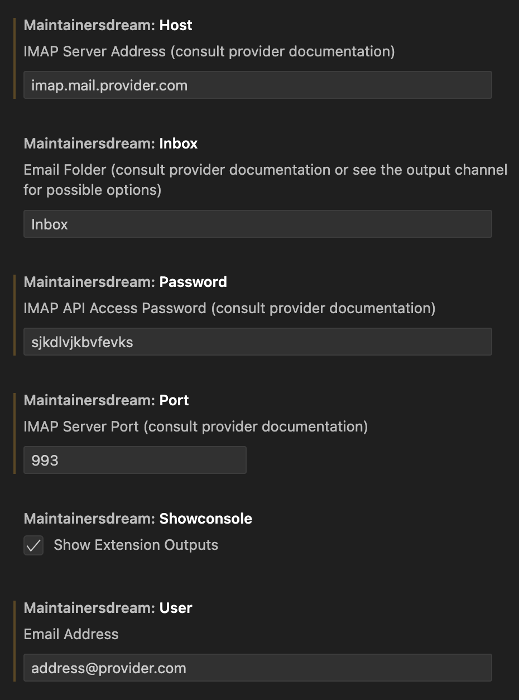
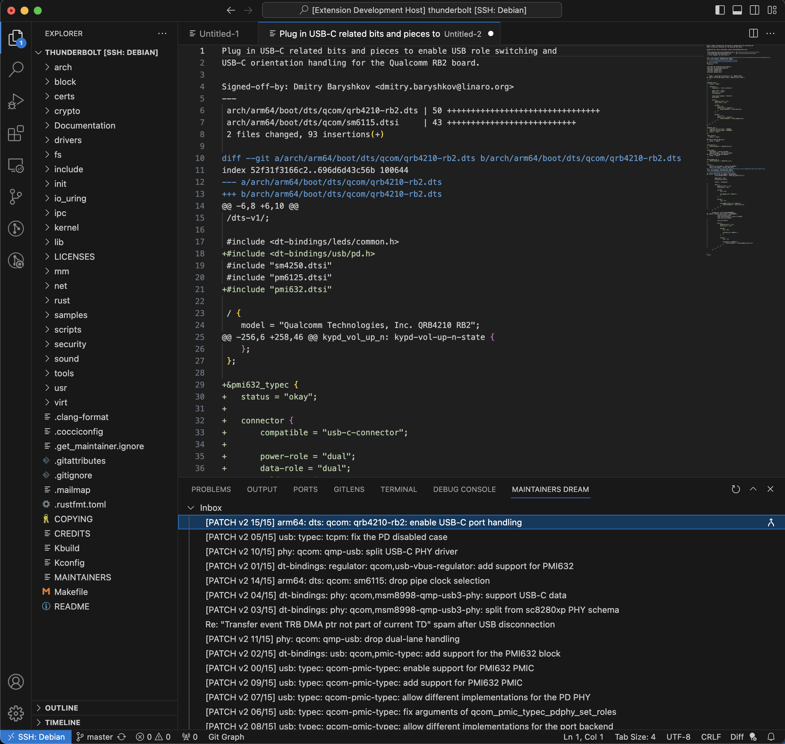

# MaintainersDream README

This extension is for maintainers who receive Git patches through emails. It shows their inbox, patch content, and a one-click way to apply the patch to the current folder. A maintainer's dream come true!

## Features

You can set the IMAP related configs in settings:

For the Inbox folder, it is better to see the extension's output channel. For Gmail it can be `INBOX` or `[Gmail]/All Mail` and for Yahoo `Inbox` or `Archive`.

For the Password setting, you can acquire an App Password for Gmail from the following path:
> Profile icon > Manage Your Google Account > Security > 2-Step Verification > App Passwords

You can refresh your inbox to get the new emails and open a patch mail by clicking on each item:

If it is a patch email, you can click the patch button to integrate the work in the current folder:

